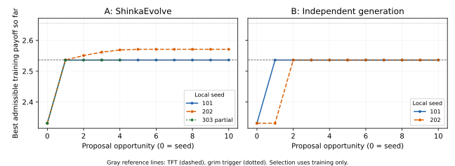

# E1: ShinkaEvolve versus independent generation — partial, stopped

2026-09-08

**E1 did not complete its planned three replicate pairs.** It stopped at **44 of 60 external proposal invocations**: A101, B101, B202 and A202 completed ten opportunities each; A303 generated four proposals; B303 never started. The closed ledger retains the unused allowance and cannot be reset.

The available paired holdout differences, A minus B, are **0.000000**, **−0.110196**, and **unavailable**. Their two-pair descriptive mean is **−0.055098** payoff per round. This partial readout provides no observed advantage for ShinkaEvolve. Its strongest training improvement transferred poorly to holdout. Two pairs and infrastructure failures do not establish a general negative effect or complete the E1 hypothesis test.

There were 44 generated sources: **40 live-valid, two interpreter rejections, and two without live evaluator results**. All 44 have Shinka database rows; 40 generated policies were retained in archives. Seed rows and `best/` copies are additional records, not proposals. Nineteen valid proposals passed the frozen TFT probes; source inspection establishes the TFT rule for eighteen, while one periodic defector exposes a finite-probe false positive.

[Every opportunity, exact prompts, generated sources and supplied contexts](PROPOSALS.md) · [machine-readable audit](audit.json) · [frozen protocol](protocol/PROTOCOL.md) · [closed ledger](ledger.json) · [commands](setup/COMMANDS.md).

## Question and design

E1 asks whether **ShinkaEvolve's combined search procedure improves the
development-holdout payoff of a candidate selected solely by training payoff**,
compared with independent generation from the same model at equal proposal
opportunities. Consistently positive paired differences would support that
hypothesis; negative differences would weaken it; small, inconsistent, or
invalidity-dominated differences would leave the comparison uncertain. There
were three runs planned per condition, not sixty independent experimental replicates.

The [protocol](protocol/PROTOCOL.md), [machine-readable configuration](protocol/protocol.json),
and [source hashes](protocol/freeze.json) were frozen in commit `e0ca3f3` before
calls. The predefined order was **A101, B101, B202, A202, A303, B303**: A first
in two pairs and B first in one, the closest possible balance with three pairs.
Each run had ten proposal opportunities. Local RNG seeds 101, 202, and 303 seed
local search sampling; they do **not** make remote outputs deterministic or
control remote randomness within pairs.

| Common elements | Condition A | Condition B |
|---|---|---|
| Native Shinka full-rewrite prompt/parser, interpreter, evaluator, model, limits, initial policy | Real Shinka weighted parent selection, accumulated programs and training feedback; one top-k inspiration when available | Context sampler returns the original seed and no inspirations at every opportunity |
| Existing ChatGPT Pro via Headless 0.6.1 / Codex 0.153.4; `gpt-5.6-terra`, low reasoning | New native Codex session per proposal | New native Codex session per proposal; byte-identical frozen initial prompt |
| One native proposal-format variant, no retries/resampling/replacements; serial execution | Fitness archive and parent selection influence later information | Common harness stores results but never supplies earlier candidates, scores or validity feedback to later proposals |

A's first prompt in each run equals B's prompt. Both start with the original
always-defect *program*, which is distinct from the random-number seeds:

```python
# EVOLVE-BLOCK-START
def policy(own_history, opponent_history):
    return 1
# EVOLVE-BLOCK-END
```

The selected candidate is the highest-training-payoff admissible program
within its run, including this seed; exact ties choose the earliest appearance.
“Selected” does not mean it beats reference TFT or grim. After the terminal stop, [the selection-state freeze](training_selections_frozen.json)
locked four completed-run selections, A303's partial best-so-far and the unchanged
seed as an explicit placeholder for unstarted B303, before any holdout or TFT
analysis. The placeholder is not a B303 result. Neither unfinished run receives
a primary holdout value. This terminal handling does not complete the originally
planned three-pair design. This compares evolutionary search
with independent generation; it does **not** isolate numerical feedback alone.

## Game and candidate interface

The candidate receives immutable tuples of its own and its opponent's completed
actions and returns integer `0` (cooperate, C) or `1` (defect, D), never a Boolean.
Both players choose using histories before the current round; their choices
are simultaneous. Histories reset to empty at the start of every match. There
is no action noise, external state, communication, opponent identity, revealed
ending time, or access to the opponent's current action.

| Own action | Other C | Other D |
|---|---:|---:|
| C | 3 | 0 |
| D | 5 | 1 |

The other player's payoff is the transposed entry. Each match independently
ends after a round with probability **0.00346**. The evaluator samples this
geometric length independently before play; candidate actions cannot change
it, and it is hidden from the policy. There is no fixed disclosed final round.

| Panel | Fixed seeds | Realized lengths, reused for each opponent | Matches / rounds |
|---|---|---|---|
| Training | 11, 23, 47, 89, 131 | 174, 747, 126, 25, 110 | 30 / 7,092 |
| Development holdout | 211, 307, 401, 503, 601 | 241, 293, 199, 55, 62 | 30 / 5,100 |

Each opponent plays five matches. Random opponents use reproducible match
streams from the first eight bytes of SHA-256 of `split/opponent/seed`, interpreted
as a big-endian integer. This fixes each scored encounter across policies.

| Panel | Opponent | Rule | Random? |
|---|---|---|---|
| Train | Always cooperate | C every round | No |
| Train | Always defect | D every round | No |
| Train | Fair random | Independent C with probability 0.5 | Yes |
| Train | TFT | C first, then copy the opponent's last action | No |
| Train | Grim trigger | C until any opponent D, then D forever | No |
| Train | Ordinary win-stay, lose-shift (WSLS) | C first; repeat own action after payoff 3 or 5, switch after 0 or 1 | No |
| Holdout | Alternator | C first, alternate C/D | No |
| Holdout | Suspicious TFT | D first, then copy the opponent's last action | No |
| Holdout | TFT for two tats | D only after two consecutive opponent defections; C for the first two rounds | No |
| Holdout | Hard TFT | D if either of the last two available opponent actions was D; C first | No |
| Holdout | Random 20 | Independent C with probability 0.2 | Yes |
| Holdout | Random 80 | Independent C with probability 0.8 | Yes |

Candidates never play one another or themselves. This is **our custom opponent-panel
experiment**, not a reconstruction of Axelrod's tournaments. Fitness is total
own training payoff divided by 7,092 rounds. Opponents have equal aggregate
weight; individual matches are weighted by their length. There is no cooperation,
TFT-similarity, simplicity, or winning-margin bonus. The already-public holdout
is a **development holdout**, not an untouched confirmatory test.

The fixed interpreter accepts one unannotated function, conditionals and returns,
integer constants, history indexes/slices, comparisons, Boolean expressions,
integer `+`, `-`, `%`, `len`, `sum`, `min`, `max`, and history `.count`. It rejects
assignments, loops, imports, literal tuples, arbitrary calls, and outside state.
Limits are 16,000 source bytes and 400 syntax-tree nodes. Code may depend on the
entire history. Evaluation interprets candidate syntax; it never imports or
executes a candidate as arbitrary Python. Invalid proposals receive the fixed
−1 sentinel and cannot be selected. Invalids and duplicates consume their slots.
An AST duplicate ignores formatting/comments and compares with earlier sources
in the same run, including the seed; it is not a claim of behavioral equivalence.

## Information and resource boundaries

The [effective local checks](setup/restriction_checks_verified.json) forced shell,
file-edit, MCP-read, agent-spawn, file-image-read and code-mode calls through the
installed Codex binary against a **localhost-only fixture**. No real model was
queried, no authentication header was sent, every call was refused, and an
outside-directory canary was neither retrieved nor modified. Search and project
instructions were disabled. Tools, MCP, skills, plugins, apps, memory and agents
were disabled with supported per-process controls. Model metadata changed only
`apply_patch_tool_type` to null to remove the file-edit tool registration.
The residual code-mode entrypoints have no nested tools and their host is
disabled. The [implementation audit](setup/IMPLEMENTATION.md) explains the controls
and tests, including the expected fail-closed startup warning.

The supervisor could read experiment files, while fresh mutation sessions
received only generic native instructions plus the permitted task, supplied
programs, training feedback and proposal format. This is an enforced and tested
native tool boundary, **not an OS confidentiality container**. A changed working
directory alone would not suffice. Pretrained knowledge remains; LLM rediscovery
is not knowledge-free invention. The original pilot remains explicitly unblinded.

The separate [E1 ledger](ledger.json) enforces at most 60 external proposal
invocations, ten per run, with reservations before launch, serial execution,
unique slots and fixed order. The exhausted pilot ledger is unchanged. There
is no automatic retry, resampling, replacement, API fallback, API-key
authentication, paid API call, purchased-credit continuation, embedding,
auxiliary model call, or GitHub Actions. Native Codex/Headless/provider bounds
are 180/210/240 seconds, plus 2,600 seconds per run. Quota checks precede launches;
backend failure stops the experiment without resetting counters. Native Headless
does not enforce `max_tokens`; equal proposal budgets are not equal computation.

The primary outcome is selected-candidate development-holdout payoff. Secondary
outcomes are training payoff, validity rate, best-training trajectory and the
appearance time of admissible TFT-compatible behavior. The existing recognition
routine checks 1,640 finite probes; passing alone proves no universal equivalence.

## What stopped the experiment

The subscription metadata read before A303 slot 5 timed out. The stop latch prevented a 45th proposal; there was no retry, replacement, quota override or reset. A read-only post-stop check succeeded and showed 4% account-wide window use with the same credit balance, so there is no evidence of quota exhaustion. The precise RPC stage of the live timeout was not logged. A local fixture reproduces a concrete vulnerability: `TextIOWrapper.readline()` can buffer a requested reply after a notification, while the next `select()` waits on an empty OS pipe. An explicit byte-buffer control receives both messages. This explains a possible failure mechanism; it does not prove the exact live cause.

A separate pinned-upstream timer defect affected **B101 slot 3 and A303 slot 4**. `AsyncRunningJob.start_time` is the proposal start, and the local scheduler compares it against the 60-second evaluation limit. Those Codex proposals took 63.5 and 82.1 seconds; their evaluators were killed about a second after submission. No metrics or correctness file was produced. Shinka stored `correct=False, score=0.0`; **0.0 is a failure placeholder, not measured payoff**. Later interpreter-only training diagnoses gave 2.295967 and 2.117879 respectively. These diagnoses did not change selections or archive membership. Neither exceeds the seed.

The stop flag halted launches, but the runner remained waiting for its separate finalization event. The supervisor sent SIGINT only to the stopped A303 child; its `finally` block saved the partial summary and the parent closed the ledger. Thus automatic launch stopping worked, while automatic cleanup needed intervention. The as-executed launcher and dependency were preserved. [Local failure reproductions](setup/failure_reproductions.json) and the [implementation audit](setup/IMPLEMENTATION.md) document these limitations. Earlier live aggregate updates overstated B101 validity; the final audited count is nine valid and one unevaluated.

A202 slot 7 was a genuine interpreter rejection: **438 AST nodes exceeded 400**. Slot 9 had **394 nodes but a forbidden tuple literal**. Their original sources and −1 sentinels remain intact. No candidate was repaired.

## Every run and the partial comparison

| Run | Training-selected source | Training | Development holdout | Valid/invalid/unevaluated/duplicate | TFT-probe-compatible slots | Improved after first? |
| --- | --- | --- | --- | --- | --- | --- |
| A101 (complete) | [slot 1](runs/A101/gen_1/main.py) | 2.536238 | 2.544314 | 10/0/0/1 | 1, 5, 7 | no |
| B101 (complete) | [slot 1](runs/B101/gen_1/main.py) | 2.536238 | 2.544314 | 9/0/1/6 | 1, 2, 4, 5, 6, 7, 8, 9 | no |
| B202 (complete) | [slot 2](runs/B202/gen_2/main.py) | 2.536238 | 2.544314 | 10/0/0/3 | 2, 3, 5, 6, 8, 10 | yes |
| A202 (complete) | [slot 5](runs/A202/gen_5/main.py) | 2.570925 | 2.434118 | 8/2/0/1 | 1 | yes |
| A303 (incomplete) | [slot 1](runs/A303/gen_1/main.py) | 2.536238 | unavailable | 3/0/1/0 | 1 | no |
| B303 (not_started) | none; seed placeholder only | unavailable | unavailable | 0/0/0/0 | none | unavailable |

Duplicates overlap validity counts; they are not an additional class. Seed 0 is eligible, but not included in the ten-proposal validity denominator.

B101 slot 3 and A303 slot 4 lack live evaluator results because of the upstream timer defect. A303 additionally has one blocked prelaunch check and five unattempted opportunities. B303 has ten unattempted opportunities. A303's training selection is provisional; neither unfinished run contributes a primary holdout result. Validity here means live evaluator acceptance, not a pure measure of generated syntax quality.

E1 applies the frozen earliest-appearance tie rule. Shinka can record a later tied program as its own best; that pointer does not override E1's predeclared selection. Both records are retained:

| Run | E1 selected slot | Shinka recorded best slot | DB rows including seed | Archive members including seed |
| --- | --- | --- | --- | --- |
| A101 | 1 | 7 | 11 | 11 |
| B101 | 1 | 9 | 11 | 10 |
| B202 | 2 | 10 | 11 | 11 |
| A202 | 5 | 8 | 11 | 9 |
| A303 | 1 | 1 | 5 | 4 |
| B303 | 0 | None | 0 | 0 |

| Paired local seed | A holdout | B holdout | A minus B |
| --- | --- | --- | --- |
| 101 | 2.544314 | 2.544314 | 0.000000 |
| 202 | 2.434118 | 2.544314 | -0.110196 |
| 303 | unavailable | unavailable | unavailable |

Descriptive paired summary: n=2.000000; mean=-0.055098; median=-0.055098; min=-0.110196; max=0.000000; sample_sd=0.077920.

## Usage

| Run | Invocations | Codex turn events | Model response records | Input | Cached subset | Output | Reasoning subset | Codex seconds | Tool calls |
| --- | --- | --- | --- | --- | --- | --- | --- | --- | --- |
| A101 | 10 | 10 | 10 | 57751 | 14592 | 8283 | 6774 | 285.5 | 0 |
| B101 | 10 | 10 | 10 | 56770 | 29184 | 7196 | 6016 | 268.4 | 0 |
| B202 | 10 | 10 | 10 | 56770 | 29184 | 6447 | 5193 | 253.3 | 0 |
| A202 | 10 | 10 | 10 | 59985 | 49664 | 11866 | 8842 | 336.6 | 0 |
| A303 | 4 | 4 | 4 | 23020 | 14592 | 5247 | 4569 | 160.1 | 0 |
| B303 | 0 | 0 | 0 | 0 | 0 | 0 | 0 | 0.0 | 0 |

Invocations can contain multiple model requests; equal invocation budgets do not imply equal tokens or runtime. Cached/reasoning counts are subsets. Native Headless list-price cost estimates are not subscription charges.


The 303 row is unavailable, not zero and not a third comparison. The reported mean, median, range and sample SD use only the two completed pairs and are descriptive. B101's consumed unevaluated opportunity is an infrastructure limitation of even that partial readout. Live acceptance rates are A101 10/10, B101 9/10, B202 10/10, A202 8/10, and A303 3/4 observed proposals; B303 has no rate. Duplicates overlap those counts.

Total usage was **44 external invocations, 44 completed Codex turn events and 44 native model-response usage records**. The equality is observed here, not a definition: an invocation can contain several model requests. Tokens total 254,296 input including 137,216 cached, and 39,039 output including 31,394 reasoning. Codex subprocesses used 1,304.1 seconds; five started Shinka runs used 1,726.0 seconds including checks, evaluation and cleanup. The $0.7300712 Headless list-price estimate is not a subscription charge. Credit balance stayed **90.6853810000**; rounded account-wide subscription use went from 3% to 4%, including concurrent supervisor use. All 44 sessions had unique native thread IDs, the requested model/effort, the expected generic base/permission instructions and exactly the recorded user prompt; no tool call was observed. [Usage evidence](usage_summary.json) preserves those separate measures.



A303 ends after its fourth generated opportunity and B303 is absent. No unattempted trajectory is filled in.

## A concrete search walkthrough

A202 slot 2 received its slot-1 TFT parent at training 2.536238 and the original defection seed as inspiration at 2.331077. The exact prompt displayed rounded feedback 2.54 and 2.33. It produced this executable period-2 override:

```python
# EVOLVE-BLOCK-START
def policy(own_history, opponent_history):
    return 0 if len(opponent_history) == 0 else 1 if len(opponent_history) >= 4 and opponent_history[-4:-2] == opponent_history[-2:] and opponent_history[-1] != opponent_history[-2] else opponent_history[-1]
# EVOLVE-BLOCK-END
```

This cooperates first, defects after two repetitions of an alternating two-action pattern, and otherwise copies the opponent's last action. Its training payoff was 2.550761. Slot 3 extended the override to period 3 (2.561619); slot 4 extended it to period 4 (2.568951). Slot 5 received slot 4 as parent and slot 3 as inspiration, with displayed feedback 2.57 and 2.56. It added periods 5 and 6, reaching 2.570925. Its complete source appears below. The parent/inspiration programs and exact prompts are preserved in the [proposal catalogue](PROPOSALS.md).

The observed training gain from slot 1 to slot 5 was 0.034687, entirely against fair random; the other five training opponents had unchanged payoff. This is a concrete path of accumulated code and training feedback. It does not identify the model's internal reasoning, or isolate the effect of numerical feedback from parent/inspiration context. A101 did not improve after its first proposal. B202 improved on its first opportunity's best-so-far by independently generating TFT at slot 2, without receiving prior results.

## Selected programs, branches and scored encounters

All sources below are exactly as generated. Actions and histories use C=0, D=1. Traces replay scored evaluator encounters with their original opponent, split, seed and match length; no extra encounter condition was added. Branch labels are derived from actual calls through the unchanged interpreter, and full-match payoff totals were checked against `environment.play`. Histories longer than 12 actions show their final 12 with `…`; full histories are in [the trace evidence](interpretation_traces.json).

### TFT: A101 and B101, and the alternate source selected in B202

A101 and B101 selected their first proposal:

```python
# EVOLVE-BLOCK-START
def policy(own_history, opponent_history):
    return 0 if len(opponent_history) == 0 else opponent_history[-1]
# EVOLVE-BLOCK-END
```

B202 selected slot 2; this same source is also A303's provisional slot-1 best:

```python
# EVOLVE-BLOCK-START
def policy(own_history, opponent_history):
    if len(opponent_history) == 0:
        return 0
    return opponent_history[-1]
# EVOLVE-BLOCK-END
```

Both functions cooperate on empty history and then return the last opponent action: C after C, D after D. They ignore own history and all earlier opponent actions. For every legal binary history these two branches are exactly the TFT definition; this source argument establishes equivalence on that domain independently of the finite probes. The code is not evidence of knowledge-free invention.

Against always-defect, training seed 11, the first eight of 174 scored rounds show the initial concession and subsequent retaliation:


| Round | Own past | Other past | Executed branch | Actions own/other | Payoff own/other | Cumulative own/other |
| --- | --- | --- | --- | --- | --- | --- |
| 1 | empty | empty | first move → C | 0/1 | 0/5 | 0/5 |
| 2 | 0 | 1 | copy last opponent action | 1/1 | 1/1 | 1/6 |
| 3 | 01 | 11 | copy last opponent action | 1/1 | 1/1 | 2/7 |
| 4 | 011 | 111 | copy last opponent action | 1/1 | 1/1 | 3/8 |
| 5 | 0111 | 1111 | copy last opponent action | 1/1 | 1/1 | 4/9 |
| 6 | 01111 | 11111 | copy last opponent action | 1/1 | 1/1 | 5/10 |
| 7 | 011111 | 111111 | copy last opponent action | 1/1 | 1/1 | 6/11 |
| 8 | 0111111 | 1111111 | copy last opponent action | 1/1 | 1/1 | 7/12 |

Against fair random with the same training seed, the following are the actual first eight rounds; each choice responds to the previous action, not the simultaneous current action:


| Round | Own past | Other past | Executed branch | Actions own/other | Payoff own/other | Cumulative own/other |
| --- | --- | --- | --- | --- | --- | --- |
| 1 | empty | empty | first move → C | 0/0 | 3/3 | 3/3 |
| 2 | 0 | 0 | copy last opponent action | 0/0 | 3/3 | 6/6 |
| 3 | 00 | 00 | copy last opponent action | 0/1 | 0/5 | 6/11 |
| 4 | 000 | 001 | copy last opponent action | 1/0 | 5/0 | 11/11 |
| 5 | 0001 | 0010 | copy last opponent action | 0/1 | 0/5 | 11/16 |
| 6 | 00010 | 00101 | copy last opponent action | 1/1 | 1/1 | 12/17 |
| 7 | 000101 | 001011 | copy last opponent action | 1/1 | 1/1 | 13/18 |
| 8 | 0001011 | 0010111 | copy last opponent action | 1/1 | 1/1 | 14/19 |

Cells below are **own payoff per round / own cooperation percentage**, pooled over the five matches per opponent. This table applies to both equivalent source forms.


| Panel | Opponent | Selected | Seed | TFT | Grim | Ordinary WSLS |
| --- | --- | --- | --- | --- | --- | --- |
| train | always_cooperate | 3.0000 / 100.0% | 5.0000 / 0.0% | 3.0000 / 100.0% | 3.0000 / 100.0% | 3.0000 / 100.0% |
| train | always_defect | 0.9958 / 0.4% | 1.0000 / 0.0% | 0.9958 / 0.4% | 0.9958 / 0.4% | 0.4992 / 50.1% |
| train | random | 2.2217 / 48.9% | 2.9492 / 0.0% | 2.2217 / 48.9% | 2.9365 / 0.8% | 2.2073 / 50.0% |
| train | tit_for_tat | 3.0000 / 100.0% | 1.0169 / 0.0% | 3.0000 / 100.0% | 3.0000 / 100.0% | 3.0000 / 100.0% |
| train | grim | 3.0000 / 100.0% | 1.0169 / 0.0% | 3.0000 / 100.0% | 3.0000 / 100.0% | 3.0000 / 100.0% |
| train | win_stay_lose_shift | 3.0000 / 100.0% | 3.0034 / 0.0% | 3.0000 / 100.0% | 3.0000 / 100.0% | 3.0000 / 100.0% |
| holdout | alternator | 2.5000 / 50.4% | 3.0094 / 0.0% | 2.5000 / 50.4% | 2.9918 / 1.2% | 2.2529 / 50.4% |
| holdout | suspicious_tit_for_tat | 2.4882 / 50.2% | 1.0000 / 0.0% | 2.4882 / 50.2% | 1.0176 / 0.6% | 1.9953 / 33.6% |
| holdout | tit_for_two_tats | 3.0000 / 100.0% | 1.0471 / 0.0% | 3.0000 / 100.0% | 3.0000 / 100.0% | 3.0000 / 100.0% |
| holdout | hard_tit_for_tat | 3.0000 / 100.0% | 1.0235 / 0.0% | 3.0000 / 100.0% | 3.0000 / 100.0% | 3.0000 / 100.0% |
| holdout | random_20 | 1.5494 / 20.6% | 1.8000 / 0.0% | 1.5494 / 20.6% | 1.7918 / 0.7% | 1.1718 / 51.5% |
| holdout | random_80 | 2.7282 / 78.4% | 4.1294 / 0.0% | 2.7282 / 78.4% | 4.0976 / 1.9% | 3.2459 / 49.6% |

### Period-detection defector: A202 slot 5

```python
# EVOLVE-BLOCK-START
def policy(own_history, opponent_history):
    return 0 if len(opponent_history) == 0 else 1 if len(opponent_history) >= 4 and opponent_history[-4:-2] == opponent_history[-2:] and opponent_history[-1] != opponent_history[-2] else 1 if len(opponent_history) >= 6 and opponent_history[-6:-3] == opponent_history[-3:] and sum(opponent_history[-3:]) > 0 and sum(opponent_history[-3:]) < 3 else 1 if len(opponent_history) >= 8 and opponent_history[-8:-4] == opponent_history[-4:] and sum(opponent_history[-4:]) > 0 and sum(opponent_history[-4:]) < 4 else 1 if len(opponent_history) >= 10 and opponent_history[-10:-5] == opponent_history[-5:] and sum(opponent_history[-5:]) > 0 and sum(opponent_history[-5:]) < 5 else 1 if len(opponent_history) >= 12 and opponent_history[-12:-6] == opponent_history[-6:] and sum(opponent_history[-6:]) > 0 and sum(opponent_history[-6:]) < 6 else opponent_history[-1]
# EVOLVE-BLOCK-END
```

It cooperates first. Thereafter it checks, in order, for two consecutive equal blocks of lengths 2, 3, 4, 5 or 6. The block must contain both actions: period 2 is explicitly alternating, and longer blocks require a defection count strictly between zero and block length. On the first matching test it defects; otherwise it copies the last opponent action. Thus it always defects after D, and defects after C only when one of these repeat tests fires. It ignores own history and uses at most the last 12 opponent actions. Detected repetition need not indicate a truly periodic opponent.

The next scored training trace uses fair random, seed 11, rounds 33–40 of 174, around the first actual departure from copying the last action. The repeated pattern is accidental in this stochastic encounter:


| Round | Own past | Other past | Executed branch | Actions own/other | Payoff own/other | Cumulative own/other |
| --- | --- | --- | --- | --- | --- | --- |
| 33 | …011111100101 | …111111001011 | copy last opponent action | 1/0 | 5/0 | 69/69 |
| 34 | …111111001011 | …111110010110 | copy last opponent action | 0/1 | 0/5 | 69/74 |
| 35 | …111110010110 | …111100101101 | period 3 → D | 1/0 | 5/0 | 74/74 |
| 36 | …111100101101 | …111001011010 | period 2 → D | 1/0 | 5/0 | 79/74 |
| 37 | …111001011011 | …110010110100 | copy last opponent action | 0/0 | 3/3 | 82/77 |
| 38 | …110010110110 | …100101101000 | copy last opponent action | 0/0 | 3/3 | 85/80 |
| 39 | …100101101100 | …001011010000 | copy last opponent action | 0/1 | 0/5 | 85/85 |
| 40 | …001011011000 | …010110100001 | copy last opponent action | 1/0 | 5/0 | 90/85 |

Against holdout alternator, seed 211, the first eight of 241 rounds show the override turning into sustained defection:


| Round | Own past | Other past | Executed branch | Actions own/other | Payoff own/other | Cumulative own/other |
| --- | --- | --- | --- | --- | --- | --- |
| 1 | empty | empty | first move → C | 0/0 | 3/3 | 3/3 |
| 2 | 0 | 0 | copy last opponent action | 0/1 | 0/5 | 3/8 |
| 3 | 00 | 01 | copy last opponent action | 1/0 | 5/0 | 8/8 |
| 4 | 001 | 010 | copy last opponent action | 0/1 | 0/5 | 8/13 |
| 5 | 0010 | 0101 | period 2 → D | 1/0 | 5/0 | 13/13 |
| 6 | 00101 | 01010 | period 2 → D | 1/1 | 1/1 | 14/14 |
| 7 | 001011 | 010101 | period 2 → D | 1/0 | 5/0 | 19/14 |
| 8 | 0010111 | 0101010 | period 2 → D | 1/1 | 1/1 | 20/15 |

Against holdout suspicious TFT with seed 211, the same period-2 test changes round 5 from the C that ordinary TFT would choose to D. The opponent also defects. Subsequent copying of D locks this encounter into mutual defection:


| Round | Own past | Other past | Executed branch | Actions own/other | Payoff own/other | Cumulative own/other |
| --- | --- | --- | --- | --- | --- | --- |
| 1 | empty | empty | first move → C | 0/1 | 0/5 | 0/5 |
| 2 | 0 | 1 | copy last opponent action | 1/0 | 5/0 | 5/5 |
| 3 | 01 | 10 | copy last opponent action | 0/1 | 0/5 | 5/10 |
| 4 | 010 | 101 | copy last opponent action | 1/0 | 5/0 | 10/10 |
| 5 | 0101 | 1010 | period 2 → D | 1/1 | 1/1 | 11/11 |
| 6 | 01011 | 10101 | period 2 → D | 1/1 | 1/1 | 12/12 |
| 7 | 010111 | 101011 | copy last opponent action | 1/1 | 1/1 | 13/13 |
| 8 | 0101111 | 1010111 | copy last opponent action | 1/1 | 1/1 | 14/14 |

Payoff and cooperation against every fixed opponent, using the same reference encounters:


| Panel | Opponent | Selected | Seed | TFT | Grim | Ordinary WSLS |
| --- | --- | --- | --- | --- | --- | --- |
| train | always_cooperate | 3.0000 / 100.0% | 5.0000 / 0.0% | 3.0000 / 100.0% | 3.0000 / 100.0% | 3.0000 / 100.0% |
| train | always_defect | 0.9958 / 0.4% | 1.0000 / 0.0% | 0.9958 / 0.4% | 0.9958 / 0.4% | 0.4992 / 50.1% |
| train | random | 2.4298 / 35.1% | 2.9492 / 0.0% | 2.2217 / 48.9% | 2.9365 / 0.8% | 2.2073 / 50.0% |
| train | tit_for_tat | 3.0000 / 100.0% | 1.0169 / 0.0% | 3.0000 / 100.0% | 3.0000 / 100.0% | 3.0000 / 100.0% |
| train | grim | 3.0000 / 100.0% | 1.0169 / 0.0% | 3.0000 / 100.0% | 3.0000 / 100.0% | 3.0000 / 100.0% |
| train | win_stay_lose_shift | 3.0000 / 100.0% | 3.0034 / 0.0% | 3.0000 / 100.0% | 3.0000 / 100.0% | 3.0000 / 100.0% |
| holdout | alternator | 2.9859 / 1.8% | 3.0094 / 0.0% | 2.5000 / 50.4% | 2.9918 / 1.2% | 2.2529 / 50.4% |
| holdout | suspicious_tit_for_tat | 1.0353 / 1.2% | 1.0000 / 0.0% | 2.4882 / 50.2% | 1.0176 / 0.6% | 1.9953 / 33.6% |
| holdout | tit_for_two_tats | 3.0000 / 100.0% | 1.0471 / 0.0% | 3.0000 / 100.0% | 3.0000 / 100.0% | 3.0000 / 100.0% |
| holdout | hard_tit_for_tat | 3.0000 / 100.0% | 1.0235 / 0.0% | 3.0000 / 100.0% | 3.0000 / 100.0% | 3.0000 / 100.0% |
| holdout | random_20 | 1.6153 / 15.1% | 1.8000 / 0.0% | 1.5494 / 20.6% | 1.7918 / 0.7% | 1.1718 / 51.5% |
| holdout | random_80 | 2.9682 / 64.8% | 4.1294 / 0.0% | 2.7282 / 78.4% | 4.0976 / 1.9% | 3.2459 / 49.6% |

Relative to TFT, training fair-random payoff increased by **0.208122** per round; the other five opponents were unchanged. On holdout, gains against alternator (+0.485882), random-20 (+0.065882) and random-80 (+0.240000) were outweighed by the suspicious-TFT loss (−1.452941). The other two holdout payoffs were unchanged. Equal opponent weights make the net difference −0.110196. These code and trace mechanisms explain the measured transfers without claiming what the model intended.

The selected period policy exceeds the seed, ordinary WSLS and TFT on training, but remains below grim's 2.655386. Its holdout 2.434118 exceeds the seed's 2.001569 but is below ordinary WSLS (2.444314), TFT (2.544314) and grim (2.649804). The selected TFT programs beat the seed and WSLS on both panels and also remain below grim. Selection therefore did not identify a universal optimum, or even the strongest fixed reference.

## Finite recognition and its explicit counterexample

The table records the frozen 1,640-probe result without retrospectively changing that recognizer. Nineteen live-valid sources pass. Seventeen directly use one of the two TFT forms above; A101 slot 7 is also equivalent on legal binary histories: if the last actions agree it returns its own action, otherwise `1-own_last` equals the opponent's last action. These eighteen have a source-based equivalence argument.

**B202 slot 5 is a counterexample to treating probe agreement as proof.** It copies the last action except that it defects when history length is a positive multiple of 32. On the actual training always-cooperate encounter with seed 11, after 32 mutual cooperations it defects in round 33 while TFT would cooperate. Its training payoff is 2.052171, although all frozen probes pass. The [source](runs/B202/gen_5/main.py) and scored round-33 counterexample are retained in the trace evidence. It is called *probe-compatible*, not universally TFT-equivalent. No probe result, source recognition, reference payoff or holdout result was supplied to mutation sessions or used for selection.

## Verification, limitations and next bounded step

The original seed, interpreter, evaluator, payoff matrix, panels, seeds, termination rule and task file match the reviewed pilot commit. The five-slot pilot ledger remains byte-identical and exhausted. Before live work the localhost restriction checks and 31-test suite passed; the final suite has **36 passing tests**, including terminal-state handling and local failure reproductions. No external smoke was used. The 45th *opportunity's* metadata check failed before a proposal launch; 44 proposal invocations, one prelaunch block and 15 never-attempted opportunities account for the planned 60 slots. The ledger retains all 16 unspent external invocations and stays closed.

The principal limitations are the unfinished third pair; two infrastructure losses; manual stop cleanup; only two available completed pairs; shared fixed development encounters; model prior knowledge; unequal token/runtime consumption; and a tested native tool boundary rather than an OS confidentiality container. The direct answer is **no observed Shinka advantage in this partial readout**, with insufficient evidence for a general conclusion. The training gains alone do not establish better transfer.

The next bounded step is to repair the demonstrated harness defects and repeat the **same** A/B design, not add noise, horizon or opponent-mixture conditions. The remaining uncertainty is whether a completed, reliably executed three-pair comparison shows a search advantage. The hypothesis remains that A improves training-selected development-holdout payoff. The only intended change is the execution harness: buffered RPC handling, an evaluation-only clock and reliable terminal finalization. Keep model/effort, task, seed policy, local seeds, order, parser, interpreter, panels, fitness and ten opportunities per run fixed. First require zero-call failure tests and a full six-run mocked rehearsal; then a separately authorized, new ledger may allow at most **60** live invocations (three pairs × two conditions × ten), including any smoke or failed launch. Consistently positive paired differences would support benefit; flat/negative differences would weaken it; another infrastructure stop would leave it unresolved. Do not reuse E1's remaining 16 slots.

**Implementation prompt for a future milestone (not executed):** “Implement E1-R with the same frozen scientific design and native subscription model. Preserve E1 and both closed ledgers. Fix explicit byte-buffer JSON-RPC reading, separate evaluation time from proposal time, and finalize stopped runners after draining work. Prove the fixes and all six runs with local mocks before any proposal call. Freeze a new protocol and separate 60-invocation ledger, with ten per run and order A101, B101, B202, A202, A303, B303. Keep all information restrictions and payoff-only selection. Execute only under that new milestone's authorization.”

Primary commands actually used (full setup and failed local-test history are in the linked command log):

```bash
.venv/bin/python check_e1_restrictions.py --output results/e1/setup/restriction_checks_verified.json
timeout 180 .venv/bin/python -m unittest discover -s tests -v > results/e1/setup/tests_final.txt 2>&1
.venv/bin/python run_e1.py --preflight > results/e1/setup/preflight.json
.venv/bin/python run_e1.py --freeze > results/e1/setup/freeze_console.txt 2>&1
.venv/bin/python run_e1.py --execute > results/e1/setup/live_console.txt 2>&1
# After the terminal stop: interrupt only the stopped A303 child; no restart.
kill -INT 1271638
.venv/bin/python subscription_status.py --output results/e1/setup/subscription_after.json
.venv/bin/python audit_e1.py --freeze-terminal
.venv/bin/python audit_e1.py > results/e1/setup/audit_console.txt 2>&1
.venv/bin/python diagnose_e1_failures.py > results/e1/setup/failure_reproductions_verified_console.txt 2>&1
MPLCONFIGDIR=/tmp/e1_matplotlib .venv/bin/python render_e1.py
.venv/bin/python write_e1_report.py
timeout 180 .venv/bin/python -m unittest discover -s tests -v > results/e1/setup/tests_post_stop.txt 2>&1
```

E1 execution returned status 2 after stopping, not success. The analysis and rendering commands use only preserved data and interpreter-based diagnostics, with no proposal or judge-model calls. Files that are single-use evidence refuse overwrite; the live launcher refuses any existing ledger.
