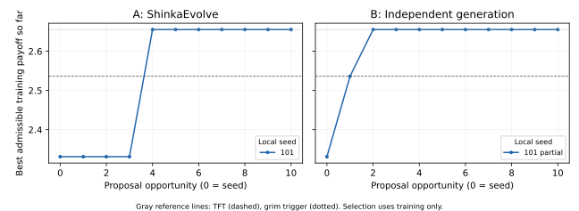

# E1-R: ShinkaEvolve versus independent generation

2026-09-08

**Completion: 1/6 runs, 20/60 external proposal invocations; ledger closed.** Execution stopped: Codex backend failure; no retry or replacement. Incomplete/unstarted runs have no primary outcome.

**The planned comparison remains unanswered: E1-R has no completed A/B pair.**
A101 completed ten opportunities; B101 consumed ten slots but its last Codex
invocation failed before supplying a policy. B202, A202, A303 and B303 never
started. Under the pre-call completion rule, B101 is incomplete even though its
budget was consumed. All three paired A-minus-B primary differences are
**unavailable**. With n=0 available pairs, the paired mean, median, range and
sample SD are undefined. Missing outcomes are not zero.

The repairs worked in this run: no generated policy lost its evaluator result,
and the terminal stop finalized automatically. The new failure was Codex's
**“Connection failed: error sending request”**, at B101 opportunity 10. The guard
latched the stop after that single failed launch; no retry, resampling,
replacement or restart occurred. The closed ledger retains **40 unused
invocations that cannot be reused**. This partial E1-R evidence is reported
separately from the earlier 44/60 E1 experiment.

**Exact TFT appeared, but was not training-selected.** Seven admissible sources
implement it: A101 slots **6 and 10**, B101 slots **1, 5, 7, 8 and 9**. They pass
all 1,640 frozen probes. Their source establishes a stronger result: each returns
integer C on empty history and exactly the opponent's last binary action
otherwise, with no other dependency. B101 slot 7 spells the latter as “1 if the
last action is 1, else 0,” which is identical on legal binary histories.
[Source diagnoses](source_diagnoses.json) record the three expression forms and
argument; the finite probes alone would not prove equivalence.

A101's selected slot **4** is **grim trigger**, with training payoff
**2.655386350818** and measured development-holdout payoff
**2.649803921569**. B101 independently generated a source-equivalent grim rule
at slot **2**, with the same measured training score, and retains it as its
provisional selection. No B101 primary holdout result was computed. Thus this
observed high-training-payoff behavior did not require accumulated feedback to
appear; the incomplete experiment cannot estimate whether evolution improves
expected selected-policy holdout payoff.

### What the selected programs do

Both original sources are reproduced completely below. A101 tests whether the
opponent history is empty **or** contains no defection. It cooperates in that
case and defects otherwise. Empty history already contains no defection, so
that first check is redundant. B101's shorter expression defects whenever the
count of opponent defections is nonzero, otherwise cooperates. Neither uses its
own history. On every finite legal binary history they implement the same rule:
**cooperate until the first opponent defection, then defect permanently**.
This is source-established grim equivalence, not a name-based classification.
They differ from TFT after an earlier defection followed by cooperation: grim
continues D, while TFT returns C.

The payoff explains the selection. Against the five deterministic training
opponents, grim and TFT earn identical averages. Against fair random, grim
earns **2.936548** per round versus TFT's **2.221658**. That single-opponent
increase of **0.714890**, divided by six equally weighted opponents, accounts
for the entire **0.119148** aggregate training gain. No resemblance, cooperation
or simplicity criterion was used.

On A101's scored holdout, grim gains against alternator (**+0.491765**), random
20% cooperation (**+0.242353**) and random 80% cooperation (**+1.369412**) relative
to TFT. It loses heavily against suspicious TFT (**−1.470588**); TFT-for-two-tats
and hard TFT are unchanged. The net aggregate difference is **+0.105490**.
These are fixed-encounter measurements, not claims of universal superiority.
The selected rule equals the existing hand-written grim reference; it is not a
newly established global optimum over the full-history search space.

The actual scored seed-211 encounter with suspicious TFT starts **C/D**, then
**D/C**, then **D/D forever**. The candidate receives 0, 5, then 1 per round.
The opponent initially defects, copies the candidate's first C on round 2,
then copies its permanent D. Against alternator, the candidate plays C in the
first two rounds and D thereafter. These branches explain the sustained
holdout loss and gain. Short scored traces and opponent totals appear below;
[additional exact traces](interpretation_traces.json) retain the branch tests
and full-match totals.

### Generated sources, validity and actual search progress

There were **19 generated sources**, all evaluated: **18 live-valid and archived**,
plus **one interpreter rejection**. A101 slot 1 has **48 AST nodes**, within the
400-node cap, but uses the forbidden tuple literal `(1, 1, 1)`. Its generic
“unsupported syntax or more than 400 AST nodes” message is specifically a tuple
rejection here. It received the fixed −1 validity sentinel and was not repaired.
B101 slot 10 produced no policy and has no evaluator result, database program
row or archive entry. Its native `llm_output_invalid` failure label reflects
missing response content downstream of the transport error; it is not evidence
of invalid generated Python.

Each started run has nine valid proposals out of ten consumed opportunities
(**90%**). Among generated files alone, the rates are 9/10 for A101 and 9/9 for
B101. There are **five AST duplicates**, three in A101 and two in B101; they
consume slots and overlap validity counts. Including the two original seed
rows, Shinka stores **21 program rows and 20 archive members**. No generated
policy is merely an unevaluated file. The four unstarted runs have no native
seed evaluation or archive; their frozen seed identities are placeholders.

A101 reached its best training score at slot 4. Slots 8 and 9 repeat that exact
grim source, and its remaining proposals do not improve the best. Native Shinka
records slot 9 as its best pointer; the frozen earliest-tie rule selects slot 4.
B101 reached its provisional best at slot 2, without receiving its slot-1 output
or score in the second session. All A initial and all ten B prompts equal the
frozen initial prompt byte for byte. Twenty fresh native sessions were recorded;
no tool call was observed, including in the failed session.

The parent-to-child example below is A101 slot 6 → slot 8: TFT → grim, a training
increase of 0.119148. **Grim slot 4 was already supplied as the top-k inspiration**,
and the child exactly repeats it. This is a real native search step but not a
new best or a novel discovery at slot 8. The record shows what information was
available; it does not reveal or establish the model's internal reasoning.

### The terminal failure and resource accounting

Invocation 20 was durably reserved at 14:33:32.732 UTC on 2026-09-08. Codex exited
with code 1 after **13.471 seconds**, emitting a connection error and
`turn.failed`. It recorded no completed Codex turn or native response-usage
record; unreported remote processing cannot be inferred from those absences.
Headless returned the same error. There was no generated code and downstream
evaluation was not submitted. The expected “Code Mode unavailable” startup
warning also appears in successful sessions; it was not the fatal error.

The stop-aware drain completed in **0.051 seconds**, with no evaluator running
and no proposal cancellation needed. The child exited with status 2, the parent
closed the ledger at its recorded return, and all six identities/statuses were
frozen at **14:33:54.708 UTC**. This required **no manual interruption**.
The exact low-level cause of the connection failure is unresolved: preserved
logs identify a send/connection failure, not a proven DNS, TLS, quota or service
cause. The targeted native warning/error log query yielded no extra diagnosis.

The post-stop read-only subscription check succeeded. Rounded account-wide
usage was **6% before and 6% after**; the credit balance remained
**90.6853810000**. There is no evidence of quota exhaustion or purchased-credit
continuation. Rounding and concurrent supervisor use prevent attributing that
account-wide percentage to E1-R alone. The two Shinka run runtimes total
**925.373 seconds**; Codex subprocess runtimes total **698.031 seconds**.
The combined Headless API-list-price estimate is **$0.3417076**, not a subscription
charge. Available usage comprises **20 external invocations, 19 completed Codex
turn events and 19 native model-response records**, distinct accounting units.

## Question and design

E1-R asks whether **ShinkaEvolve's combined search procedure improves the
development-holdout payoff of a candidate selected solely by training payoff**,
compared with independent generation from the same model at equal proposal
opportunities. Consistently positive paired differences would support that
hypothesis; negative differences would weaken it; small, inconsistent, or
invalidity-dominated differences would leave the comparison uncertain. There
were three runs planned per condition, not sixty independent experimental replicates.

The [protocol](protocol/PROTOCOL.md), [machine-readable configuration](protocol/protocol.json),
and [source hashes](protocol/freeze.json) were frozen in commit `b6647198e07df4eba7f23b0507dda0ea3d6e322a` before
calls. The predefined order was **A101, B101, B202, A202, A303, B303**: A first
in two pairs and B first in one, the closest possible balance with three pairs.
Each run had ten proposal opportunities. Local RNG seeds 101, 202, and 303 seed
local search sampling; they do **not** make remote outputs deterministic or
control remote randomness within pairs.

| Common elements | Condition A | Condition B |
|---|---|---|
| Native Shinka full-rewrite prompt/parser, interpreter, evaluator, model, limits, initial policy | Real Shinka weighted parent selection, accumulated programs and training feedback; one top-k inspiration when available | Context sampler returns the original seed and no inspirations at every opportunity |
| Existing ChatGPT Pro via Headless 0.6.1 / Codex 0.153.4; `gpt-5.6-terra`, low reasoning | New native Codex session per proposal | New native Codex session per proposal; byte-identical frozen initial prompt |
| One native proposal-format variant, no retries/resampling/replacements; serial execution | Fitness archive and parent selection influence later information | Common harness stores results but never supplies earlier candidates, scores or validity feedback to later proposals |

A's first prompt in each run equals B's prompt. Both start with the original
always-defect *program*, which is distinct from the random-number seeds:

```python
# EVOLVE-BLOCK-START
def policy(own_history, opponent_history):
    return 1
# EVOLVE-BLOCK-END
```

The selected candidate is the highest-training-payoff admissible program
within its run, including this seed; exact ties choose the earliest appearance.
“Selected” does not mean it beats reference TFT or grim. All six source identities
were frozen in [training_selections_frozen.json](training_selections_frozen.json)
before holdout evaluation or TFT recognition. This compares evolutionary search
with independent generation; it does **not** isolate numerical feedback alone.

## Game and candidate interface

The candidate receives immutable tuples of its own and its opponent's completed
actions and returns integer `0` (cooperate, C) or `1` (defect, D), never a Boolean.
Both players choose using histories before the current round; their choices
are simultaneous. Histories reset to empty at the start of every match. There
is no action noise, external state, communication, opponent identity, revealed
ending time, or access to the opponent's current action.

| Own action | Other C | Other D |
|---|---:|---:|
| C | 3 | 0 |
| D | 5 | 1 |

The other player's payoff is the transposed entry. Each match independently
ends after a round with probability **0.00346**. The evaluator samples this
geometric length independently before play; candidate actions cannot change
it, and it is hidden from the policy. There is no fixed disclosed final round.

| Panel | Fixed seeds | Realized lengths, reused for each opponent | Matches / rounds |
|---|---|---|---|
| Training | 11, 23, 47, 89, 131 | 174, 747, 126, 25, 110 | 30 / 7,092 |
| Development holdout | 211, 307, 401, 503, 601 | 241, 293, 199, 55, 62 | 30 / 5,100 |

Each opponent plays five matches. Random opponents use reproducible match
streams from the first eight bytes of SHA-256 of `split/opponent/seed`, interpreted
as a big-endian integer. This fixes each scored encounter across policies.

| Panel | Opponent | Rule | Random? |
|---|---|---|---|
| Train | Always cooperate | C every round | No |
| Train | Always defect | D every round | No |
| Train | Fair random | Independent C with probability 0.5 | Yes |
| Train | TFT | C first, then copy the opponent's last action | No |
| Train | Grim trigger | C until any opponent D, then D forever | No |
| Train | Ordinary win-stay, lose-shift (WSLS) | C first; repeat own action after payoff 3 or 5, switch after 0 or 1 | No |
| Holdout | Alternator | C first, alternate C/D | No |
| Holdout | Suspicious TFT | D first, then copy the opponent's last action | No |
| Holdout | TFT for two tats | D only after two consecutive opponent defections; C for the first two rounds | No |
| Holdout | Hard TFT | D if either of the last two available opponent actions was D; C first | No |
| Holdout | Random 20 | Independent C with probability 0.2 | Yes |
| Holdout | Random 80 | Independent C with probability 0.8 | Yes |

Candidates never play one another or themselves. This is **our custom opponent-panel
experiment**, not a reconstruction of Axelrod's tournaments. Fitness is total
own training payoff divided by 7,092 rounds: `F(policy) = sum(own payoff over every training round) / 7092`. Opponents have equal aggregate
weight; individual matches are weighted by their length. There is no cooperation,
TFT-similarity, simplicity, or winning-margin bonus. The already-public holdout
is a **development holdout**, not an untouched confirmatory test.

The fixed interpreter accepts one unannotated function, conditionals and returns,
integer constants, history indexes/slices, comparisons, Boolean expressions,
integer `+`, `-`, `%`, `len`, `sum`, `min`, `max`, and history `.count`. It rejects
assignments, loops, imports, literal tuples, arbitrary calls, and outside state.
Limits are 16,000 source bytes and 400 syntax-tree nodes. Code may depend on the
entire history. Evaluation interprets candidate syntax; it never imports or
executes a candidate as arbitrary Python. Invalid proposals receive the fixed
−1 sentinel and cannot be selected. Invalids and duplicates consume their slots.
An AST duplicate ignores formatting/comments and compares with earlier sources
in the same run, including the seed; it is not a claim of behavioral equivalence.

## Information and resource boundaries

The [effective local checks](setup/restriction_checks_verified.json) forced shell,
file-edit, MCP-read, agent-spawn, file-image-read and code-mode calls through the
installed Codex binary against a **localhost-only fixture**. No real model was
queried, no authentication header was sent, every call was refused, and an
outside-directory canary was neither retrieved nor modified. Search and project
instructions were disabled. Tools, MCP, skills, plugins, apps, memory and agents
were disabled with supported per-process controls. Model metadata changed only
`apply_patch_tool_type` to null to remove the file-edit tool registration.
The residual code-mode entrypoints have no nested tools and their host is
disabled. The [implementation audit](setup/IMPLEMENTATION.md) explains the controls
and tests, including the expected fail-closed startup warning.

The supervisor could read experiment files, while fresh mutation sessions
received only generic native instructions plus the permitted task, supplied
programs, training feedback and proposal format. This is an enforced and tested
native tool boundary, **not an OS confidentiality container**. A changed working
directory alone would not suffice. Pretrained knowledge remains; LLM rediscovery
is not knowledge-free invention. The original pilot remains explicitly unblinded.

The separate [E1-R ledger](ledger.json) enforces at most 60 external proposal
invocations, ten per run, with reservations before launch, serial execution,
unique slots and fixed order. The exhausted pilot and closed 44/60 E1 ledgers are unchanged and never pooled with E1-R. There
is no automatic retry, resampling, replacement, API fallback, API-key
authentication, paid API call, purchased-credit continuation, embedding,
auxiliary model call, or GitHub Actions. Native Codex/Headless/provider bounds
are 180/210/240 seconds, plus 2,600 seconds per run. Quota checks precede launches;
backend failure stops the experiment without resetting counters. E1-R repairs the buffered metadata transport, evaluation clock, and terminal finalization; stopped work drains within 350 seconds and the parent closes the ledger automatically. Native Headless
does not enforce `max_tokens`; equal proposal budgets are not equal computation.

The primary outcome is selected-candidate development-holdout payoff. Secondary
outcomes are training payoff, validity rate, best-training trajectory and the
appearance time of admissible TFT-compatible behavior. The existing recognition
routine checks 1,640 finite probes; passing alone proves no universal equivalence.

## Game rounds versus search iterations

A game round is one simultaneous action by each player. A proposal/search iteration asks the model for one candidate program; an admissible program is then scored across 30 training matches containing 7,092 game rounds. Each match resets its action histories. The ten proposal opportunities per run are separate from those game rounds. A receives earlier training information across search iterations; B's fresh sessions always receive the original information. A Codex invocation may contain multiple model requests or turns; none of these units are interchangeable.

## Every run, paired outcomes, selected sources and scored traces

The following tables are derived from the archived live evaluator records and post-freeze analysis. All three paired differences are run-level A minus B; missing pairs are excluded, never set to zero. The descriptive sample SD uses only available pairs. E1-R is reported separately from E1: the previous 44 proposals and this repetition are not pooled as additional independent replicates.


| Run | Training-selected source | Training | Development holdout | Valid/rejected-or-failed/unevaluated/duplicate | TFT-probe-compatible slots | Improved after first? |
| --- | --- | --- | --- | --- | --- | --- |
| A101 (complete) | [slot 4](runs/A101/gen_4/main.py) | 2.655386 | 2.649804 | 9/1/0/3 | 6, 10 | yes |
| B101 (incomplete) | [slot 2](runs/B101/gen_2/main.py) | 2.655386 | unavailable | 9/1/0/2 | 1, 5, 7, 8, 9 | yes |
| B202 (not_started) | none; seed placeholder only | unavailable | unavailable | 0/0/0/0 | none | unavailable |
| A202 (not_started) | none; seed placeholder only | unavailable | unavailable | 0/0/0/0 | none | unavailable |
| A303 (not_started) | none; seed placeholder only | unavailable | unavailable | 0/0/0/0 | none | unavailable |
| B303 (not_started) | none; seed placeholder only | unavailable | unavailable | 0/0/0/0 | none | unavailable |

Duplicates overlap validity counts; they are not an additional class. Seed 0 is eligible, but not included in the ten-proposal validity denominator.

Validity means live evaluator acceptance; duplicates overlap validity. Incomplete/unstarted runs have no primary outcome. Missing results are never zero payoff.

| Run | Generated sources | Live-valid | Interpreter rejections | No-source failed invocation | Valid / consumed opportunities |
| --- | --- | --- | --- | --- | --- |
| A101 | 10 | 9 | 1 | 0 | 9/10 |
| B101 | 9 | 9 | 0 | 1 | 9/10 |
| B202 | 0 | 0 | 0 | 0 | unavailable |
| A202 | 0 | 0 | 0 | 0 | unavailable |
| A303 | 0 | 0 | 0 | 0 | unavailable |
| B303 | 0 | 0 | 0 | 0 | unavailable |

E1-R applies the frozen earliest-appearance tie rule. Shinka can record a later tied program as its own best; that pointer does not override E1-R's predeclared selection. Both records are retained:

| Run | E1-R selected slot | Shinka recorded best slot | DB rows including seed | Archive members including seed |
| --- | --- | --- | --- | --- |
| A101 | 4 | 9 | 11 | 10 |
| B101 | 2 | 2 | 10 | 10 |
| B202 | 0 | None | 0 | 0 |
| A202 | 0 | None | 0 | 0 |
| A303 | 0 | None | 0 | 0 |
| B303 | 0 | None | 0 | 0 |

| Paired local seed | A holdout | B holdout | A minus B |
| --- | --- | --- | --- |
| 101 | 2.649804 | unavailable | unavailable |
| 202 | unavailable | unavailable | unavailable |
| 303 | unavailable | unavailable | unavailable |

Descriptive paired summary: n=0.

There are zero available completed pairs. Mean, median, range and sample SD are undefined; no effect estimate can be computed.

## Usage

| Run | Invocations | Codex turn events | Model response records | Input | Cached subset | Output | Reasoning subset | Codex seconds | Tool calls |
| --- | --- | --- | --- | --- | --- | --- | --- | --- | --- |
| A101 | 10 | 10 | 10 | 57590 | 19456 | 9025 | 7699 | 413.0 | 0 |
| B101 | 10 | 9 | 9 | 51093 | 14592 | 6444 | 5349 | 285.0 | 0 |
| B202 | 0 | 0 | 0 | 0 | 0 | 0 | 0 | 0.0 | 0 |
| A202 | 0 | 0 | 0 | 0 | 0 | 0 | 0 | 0.0 | 0 |
| A303 | 0 | 0 | 0 | 0 | 0 | 0 | 0 | 0.0 | 0 |
| B303 | 0 | 0 | 0 | 0 | 0 | 0 | 0 | 0.0 | 0 |

Invocations can contain multiple model requests; equal invocation budgets do not imply equal tokens or runtime. Cached/reasoning counts are subsets. Native Headless list-price cost estimates are not subscription charges.

## Complete selected source: A101

```python
# EVOLVE-BLOCK-START
def policy(own_history, opponent_history):
    return 0 if len(opponent_history) == 0 or opponent_history.count(1) == 0 else 1
# EVOLVE-BLOCK-END
```

Source SHA-256: `fc938dea6c869791ffb3d7fbbb03f95b21ea86152fb3414345a9d107323d56a1`.

Trace test key: **T1** = `len(opponent_history) == 0 or opponent_history.count(1) == 0`.

### Scored encounter trace: train / always_defect / seed 11

First 8 rounds of the actual 174-round evaluated encounter; full-match candidate payoff 173. C=0, D=1. Tests are listed in actual interpreter execution order; true/false identifies the executed branch. The replay's full totals are asserted equal to the unchanged evaluator.

| Round | Own history | Opponent history | Executed tests | Actions own/other | Payoff own/other | Cumulative own/other |
| --- | --- | --- | --- | --- | --- | --- |
| 1 | empty | empty | T1=true | 0/1 | 0/5 | 0/5 |
| 2 | 0 | 1 | T1=false | 1/1 | 1/1 | 1/6 |
| 3 | 01 | 11 | T1=false | 1/1 | 1/1 | 2/7 |
| 4 | 011 | 111 | T1=false | 1/1 | 1/1 | 3/8 |
| 5 | 0111 | 1111 | T1=false | 1/1 | 1/1 | 4/9 |
| 6 | 01111 | 11111 | T1=false | 1/1 | 1/1 | 5/10 |
| 7 | 011111 | 111111 | T1=false | 1/1 | 1/1 | 6/11 |
| 8 | 0111111 | 1111111 | T1=false | 1/1 | 1/1 | 7/12 |

### Scored encounter trace: train / random / seed 11

First 8 rounds of the actual 174-round evaluated encounter; full-match candidate payoff 521. C=0, D=1. Tests are listed in actual interpreter execution order; true/false identifies the executed branch. The replay's full totals are asserted equal to the unchanged evaluator.

| Round | Own history | Opponent history | Executed tests | Actions own/other | Payoff own/other | Cumulative own/other |
| --- | --- | --- | --- | --- | --- | --- |
| 1 | empty | empty | T1=true | 0/0 | 3/3 | 3/3 |
| 2 | 0 | 0 | T1=true | 0/0 | 3/3 | 6/6 |
| 3 | 00 | 00 | T1=true | 0/1 | 0/5 | 6/11 |
| 4 | 000 | 001 | T1=false | 1/0 | 5/0 | 11/11 |
| 5 | 0001 | 0010 | T1=false | 1/1 | 1/1 | 12/12 |
| 6 | 00011 | 00101 | T1=false | 1/1 | 1/1 | 13/13 |
| 7 | 000111 | 001011 | T1=false | 1/1 | 1/1 | 14/14 |
| 8 | 0001111 | 0010111 | T1=false | 1/1 | 1/1 | 15/15 |

### Scored encounter trace: train / tit_for_tat / seed 11

First 8 rounds of the actual 174-round evaluated encounter; full-match candidate payoff 522. C=0, D=1. Tests are listed in actual interpreter execution order; true/false identifies the executed branch. The replay's full totals are asserted equal to the unchanged evaluator.

| Round | Own history | Opponent history | Executed tests | Actions own/other | Payoff own/other | Cumulative own/other |
| --- | --- | --- | --- | --- | --- | --- |
| 1 | empty | empty | T1=true | 0/0 | 3/3 | 3/3 |
| 2 | 0 | 0 | T1=true | 0/0 | 3/3 | 6/6 |
| 3 | 00 | 00 | T1=true | 0/0 | 3/3 | 9/9 |
| 4 | 000 | 000 | T1=true | 0/0 | 3/3 | 12/12 |
| 5 | 0000 | 0000 | T1=true | 0/0 | 3/3 | 15/15 |
| 6 | 00000 | 00000 | T1=true | 0/0 | 3/3 | 18/18 |
| 7 | 000000 | 000000 | T1=true | 0/0 | 3/3 | 21/21 |
| 8 | 0000000 | 0000000 | T1=true | 0/0 | 3/3 | 24/24 |

### Scored encounter trace: holdout / alternator / seed 211

First 8 rounds of the actual 241-round evaluated encounter; full-match candidate payoff 722. C=0, D=1. Tests are listed in actual interpreter execution order; true/false identifies the executed branch. The replay's full totals are asserted equal to the unchanged evaluator.

| Round | Own history | Opponent history | Executed tests | Actions own/other | Payoff own/other | Cumulative own/other |
| --- | --- | --- | --- | --- | --- | --- |
| 1 | empty | empty | T1=true | 0/0 | 3/3 | 3/3 |
| 2 | 0 | 0 | T1=true | 0/1 | 0/5 | 3/8 |
| 3 | 00 | 01 | T1=false | 1/0 | 5/0 | 8/8 |
| 4 | 001 | 010 | T1=false | 1/1 | 1/1 | 9/9 |
| 5 | 0011 | 0101 | T1=false | 1/0 | 5/0 | 14/9 |
| 6 | 00111 | 01010 | T1=false | 1/1 | 1/1 | 15/10 |
| 7 | 001111 | 010101 | T1=false | 1/0 | 5/0 | 20/10 |
| 8 | 0011111 | 0101010 | T1=false | 1/1 | 1/1 | 21/11 |

### Opponent payoff and cooperation

Cells show own payoff per round and own cooperation percentage, aggregated across the five scored matches for that opponent. All comparators use identical encounters.

**train**

| Opponent | Selected | Seed | TFT | Grim | Ordinary WSLS |
| --- | --- | --- | --- | --- | --- |
| always_cooperate | 3.0000 (100.0%) | 5.0000 (0.0%) | 3.0000 (100.0%) | 3.0000 (100.0%) | 3.0000 (100.0%) |
| always_defect | 0.9958 (0.4%) | 1.0000 (0.0%) | 0.9958 (0.4%) | 0.9958 (0.4%) | 0.4992 (50.1%) |
| random | 2.9365 (0.8%) | 2.9492 (0.0%) | 2.2217 (48.9%) | 2.9365 (0.8%) | 2.2073 (50.0%) |
| tit_for_tat | 3.0000 (100.0%) | 1.0169 (0.0%) | 3.0000 (100.0%) | 3.0000 (100.0%) | 3.0000 (100.0%) |
| grim | 3.0000 (100.0%) | 1.0169 (0.0%) | 3.0000 (100.0%) | 3.0000 (100.0%) | 3.0000 (100.0%) |
| win_stay_lose_shift | 3.0000 (100.0%) | 3.0034 (0.0%) | 3.0000 (100.0%) | 3.0000 (100.0%) | 3.0000 (100.0%) |

**holdout**

| Opponent | Selected | Seed | TFT | Grim | Ordinary WSLS |
| --- | --- | --- | --- | --- | --- |
| alternator | 2.9918 (1.2%) | 3.0094 (0.0%) | 2.5000 (50.4%) | 2.9918 (1.2%) | 2.2529 (50.4%) |
| suspicious_tit_for_tat | 1.0176 (0.6%) | 1.0000 (0.0%) | 2.4882 (50.2%) | 1.0176 (0.6%) | 1.9953 (33.6%) |
| tit_for_two_tats | 3.0000 (100.0%) | 1.0471 (0.0%) | 3.0000 (100.0%) | 3.0000 (100.0%) | 3.0000 (100.0%) |
| hard_tit_for_tat | 3.0000 (100.0%) | 1.0235 (0.0%) | 3.0000 (100.0%) | 3.0000 (100.0%) | 3.0000 (100.0%) |
| random_20 | 1.7918 (0.7%) | 1.8000 (0.0%) | 1.5494 (20.6%) | 1.7918 (0.7%) | 1.1718 (51.5%) |
| random_80 | 4.0976 (1.9%) | 4.1294 (0.0%) | 2.7282 (78.4%) | 4.0976 (1.9%) | 3.2459 (49.6%) |

## Complete selected source: B101 (partial)

```python
# EVOLVE-BLOCK-START
def policy(own_history, opponent_history):
    return 1 if opponent_history.count(1) else 0
# EVOLVE-BLOCK-END
```

Source SHA-256: `68b703128085b98c09b5ff66507e9d3e1ba1ff0b49201bfb6b72c0c4b475acf1`.

Trace test key: **T1** = `opponent_history.count(1)`.

### Scored encounter trace: train / always_defect / seed 11

First 8 rounds of the actual 174-round evaluated encounter; full-match candidate payoff 173. C=0, D=1. Tests are listed in actual interpreter execution order; true/false identifies the executed branch. The replay's full totals are asserted equal to the unchanged evaluator.

| Round | Own history | Opponent history | Executed tests | Actions own/other | Payoff own/other | Cumulative own/other |
| --- | --- | --- | --- | --- | --- | --- |
| 1 | empty | empty | T1=false | 0/1 | 0/5 | 0/5 |
| 2 | 0 | 1 | T1=true | 1/1 | 1/1 | 1/6 |
| 3 | 01 | 11 | T1=true | 1/1 | 1/1 | 2/7 |
| 4 | 011 | 111 | T1=true | 1/1 | 1/1 | 3/8 |
| 5 | 0111 | 1111 | T1=true | 1/1 | 1/1 | 4/9 |
| 6 | 01111 | 11111 | T1=true | 1/1 | 1/1 | 5/10 |
| 7 | 011111 | 111111 | T1=true | 1/1 | 1/1 | 6/11 |
| 8 | 0111111 | 1111111 | T1=true | 1/1 | 1/1 | 7/12 |

### Scored encounter trace: train / random / seed 11

First 8 rounds of the actual 174-round evaluated encounter; full-match candidate payoff 521. C=0, D=1. Tests are listed in actual interpreter execution order; true/false identifies the executed branch. The replay's full totals are asserted equal to the unchanged evaluator.

| Round | Own history | Opponent history | Executed tests | Actions own/other | Payoff own/other | Cumulative own/other |
| --- | --- | --- | --- | --- | --- | --- |
| 1 | empty | empty | T1=false | 0/0 | 3/3 | 3/3 |
| 2 | 0 | 0 | T1=false | 0/0 | 3/3 | 6/6 |
| 3 | 00 | 00 | T1=false | 0/1 | 0/5 | 6/11 |
| 4 | 000 | 001 | T1=true | 1/0 | 5/0 | 11/11 |
| 5 | 0001 | 0010 | T1=true | 1/1 | 1/1 | 12/12 |
| 6 | 00011 | 00101 | T1=true | 1/1 | 1/1 | 13/13 |
| 7 | 000111 | 001011 | T1=true | 1/1 | 1/1 | 14/14 |
| 8 | 0001111 | 0010111 | T1=true | 1/1 | 1/1 | 15/15 |

### Scored encounter trace: train / tit_for_tat / seed 11

First 8 rounds of the actual 174-round evaluated encounter; full-match candidate payoff 522. C=0, D=1. Tests are listed in actual interpreter execution order; true/false identifies the executed branch. The replay's full totals are asserted equal to the unchanged evaluator.

| Round | Own history | Opponent history | Executed tests | Actions own/other | Payoff own/other | Cumulative own/other |
| --- | --- | --- | --- | --- | --- | --- |
| 1 | empty | empty | T1=false | 0/0 | 3/3 | 3/3 |
| 2 | 0 | 0 | T1=false | 0/0 | 3/3 | 6/6 |
| 3 | 00 | 00 | T1=false | 0/0 | 3/3 | 9/9 |
| 4 | 000 | 000 | T1=false | 0/0 | 3/3 | 12/12 |
| 5 | 0000 | 0000 | T1=false | 0/0 | 3/3 | 15/15 |
| 6 | 00000 | 00000 | T1=false | 0/0 | 3/3 | 18/18 |
| 7 | 000000 | 000000 | T1=false | 0/0 | 3/3 | 21/21 |
| 8 | 0000000 | 0000000 | T1=false | 0/0 | 3/3 | 24/24 |

### Opponent payoff and cooperation

Cells show own payoff per round and own cooperation percentage, aggregated across the five scored matches for that opponent. All comparators use identical encounters.

**train**

| Opponent | Selected | Seed | TFT | Grim | Ordinary WSLS |
| --- | --- | --- | --- | --- | --- |
| always_cooperate | 3.0000 (100.0%) | 5.0000 (0.0%) | 3.0000 (100.0%) | 3.0000 (100.0%) | 3.0000 (100.0%) |
| always_defect | 0.9958 (0.4%) | 1.0000 (0.0%) | 0.9958 (0.4%) | 0.9958 (0.4%) | 0.4992 (50.1%) |
| random | 2.9365 (0.8%) | 2.9492 (0.0%) | 2.2217 (48.9%) | 2.9365 (0.8%) | 2.2073 (50.0%) |
| tit_for_tat | 3.0000 (100.0%) | 1.0169 (0.0%) | 3.0000 (100.0%) | 3.0000 (100.0%) | 3.0000 (100.0%) |
| grim | 3.0000 (100.0%) | 1.0169 (0.0%) | 3.0000 (100.0%) | 3.0000 (100.0%) | 3.0000 (100.0%) |
| win_stay_lose_shift | 3.0000 (100.0%) | 3.0034 (0.0%) | 3.0000 (100.0%) | 3.0000 (100.0%) | 3.0000 (100.0%) |

holdout evaluation unavailable: Run incomplete/unstarted; no primary holdout result computed.

## Training trajectories



The trajectory includes the original seed at opportunity zero and retains invalid/duplicate opportunities. The [complete catalogue](PROPOSALS.md) gives every planned slot, original source, exact prompt, supplied parent/inspirations, score, validity, failure, database and archive membership. Generated files, evaluator acceptance, database rows and archive membership are separate facts. A copied `best/` file is not another proposal. Earliest-tie selections can differ from Shinka's best pointer.

## One actual evolutionary parent-to-child step

**A101, parent generation 6 → child opportunity 8.** The parent training payoff was 2.536238014664; the child earned 2.655386350818; change **+0.119148336153**. This step was chosen for explanation after all selections were frozen, as the largest measured parent-to-child gain among A proposals with a generated parent. It did not influence search or selection.

[Exact prompt](runs/A101/invocations/08/prompt.md) · [original context record](runs/A101/gen_8/supplied_context.json). The parent public metrics were `{"mean_payoff": 2.5362380146644106}` and text feedback ``. Native prompts render numeric payoff to two decimal places; archival scores here retain full precision.

**Complete supplied parent:**

```python
# EVOLVE-BLOCK-START
def policy(own_history, opponent_history):
    return 0 if len(opponent_history) == 0 else opponent_history[-1]
# EVOLVE-BLOCK-END
```

**Supplied inspiration, generation 4, training 2.655386350818:**

```python
# EVOLVE-BLOCK-START
def policy(own_history, opponent_history):
    return 0 if len(opponent_history) == 0 or opponent_history.count(1) == 0 else 1
# EVOLVE-BLOCK-END
```

**Complete generated child:**

```python
# EVOLVE-BLOCK-START
def policy(own_history, opponent_history):
    return 0 if len(opponent_history) == 0 or opponent_history.count(1) == 0 else 1
# EVOLVE-BLOCK-END
```

**Original code change:**

```diff
--- supplied_parent.py
+++ generated_child.py
@@ -1,4 +1,4 @@
 # EVOLVE-BLOCK-START
 def policy(own_history, opponent_history):
-    return 0 if len(opponent_history) == 0 else opponent_history[-1]
+    return 0 if len(opponent_history) == 0 or opponent_history.count(1) == 0 else 1
 # EVOLVE-BLOCK-END

```

This establishes which code and feedback preceded a measured change. It does not establish the model's internal reasoning or a causal effect of numerical feedback alone. Selection, inherited programs and inspirations all differ between A and B.

## Execution repairs, usage and limitations

The scientific source files and old ledgers remain unchanged. The [versioned runtime adapters](setup/IMPLEMENTATION.md) fix byte-buffered metadata reading, use actual evaluation start for the 60-second limit, and finalize stopped native runners after bounded draining. The installed pinned Shinka dependency is unchanged and hash-checked. The 52-test pre-call suite, full six-run mock rehearsal, forced metadata/backend/quota stops and old-failure reproductions passed before the protocol commit. Earlier local fixture failures are preserved and are not experimental proposals.

Available usage records distinguish **20 external invocations**, **19 completed Codex turn events** and **19 native response-usage records**. Tokens: `{"input_tokens": 108683, "cached_input_tokens": 34048, "cache_write_input_tokens": 0, "output_tokens": 15469, "reasoning_output_tokens": 13048, "total_tokens": 124152}`; Codex runtime **698.0 seconds**. Cached input and reasoning output are subsets. Equal proposal counts do not imply equal token or runtime consumption. Native Headless does not enforce max_tokens. API-list-price estimates are not subscription charges.

Fresh-session native user/base/permission contexts are checked against the frozen prompt and forced local fixture. Retrieval restrictions use supported per-process controls, not a changed directory alone; no global credentials or permissions were changed. This is a tested native tool boundary, not an OS confidentiality container. Model prior knowledge remains; operational rediscovery is not knowledge-free invention.

Three paired runs are exploratory. The fixed already-public development encounters are reused; this is not an untouched confirmatory holdout. Local seeds do not make remote model outputs deterministic. Fixed encounter lengths and opponent mixtures can reward sample-specific behavior. Finite probe agreement alone is not equivalence: E1's [B202 slot-5 periodic-defection counterexample](../e1/runs/B202/gen_5/main.py) passes all 1,640 frozen probes yet defects after 32 prior cooperations. E1-R retains those probes for comparability and separately inspects source. No target-strategy reward, manual candidate repair, evaluator relaxation or additional scientific condition was introduced.

## Next bounded step — proposed, not executed

Before another scientific repeat, run **one transport-reliability diagnostic
with at most three newly authorized subscription invocations**. Keep the same
model, low effort, native Headless/Codex route, retrieval restrictions, serial
execution and time limits. Use a fixed non-game text prompt, no scientific
scoring, no retries or replacements, and a separate durable ledger. Record
sanitized transport-stage timing and available request/error identifiers; stop
on the first backend failure and preserve it. First exercise the same failure
locally without external calls. This directly addresses the new uncertainty:
why an ordinary send failed after 19 successful invocations. Three successes
would be a small integration check, not proof of reliability or a completed
A/B experiment. Do not reopen E1-R or reuse its remaining 40 slots.

No follow-up invocation, additional scientific condition, noise, horizon or
opponent-mixture experiment was executed. A later scientific comparison still
needs its own protocol and allowance; the present paired-effect question remains
unanswered.

## Evidence and commands

Publication verification independently reproduced the archived audit, source proofs, scored traces and usage, checked all 20 native contexts and both SQLite databases, and confirmed unchanged frozen sources and ledger. The final 52-test suite and both zero-call preflights passed. The [publication audit](setup/PUBLICATION_AUDIT.md) records these checks and the preserved local sandbox test stall.

[Protocol](protocol/PROTOCOL.md) · [configuration](protocol/protocol.json) · [source freeze](protocol/freeze.json) · [closed ledger](ledger.json) · [all selections frozen](training_selections_frozen.json) · [audit](audit.json) · [usage](usage_summary.json) · [every proposal](PROPOSALS.md) · [commands and local failure history](setup/COMMANDS.md). Candidate programs were interpreted through policy.py, never imported or exec'd. Prompts, generated sources, failures, scores, native contexts and archives are preserved without credentials.

```bash
.venv/bin/python -m unittest discover -s tests -v
.venv/bin/python run_e1r.py --preflight
.venv/bin/python check_e1r_restrictions.py --output results/e1_r/setup/restriction_checks_verified.json
.venv/bin/python rehearse_e1r.py --root results/e1_r/setup/rehearsal_release
.venv/bin/python run_e1r.py --freeze
# Protocol, fixes, configuration, source hashes and zero-call ledger committed before calls.
.venv/bin/python run_e1r.py --execute > results/e1_r/setup/live_console.txt 2>&1
.venv/bin/python e1r_status.py --output results/e1_r/setup/subscription_after.json
.venv/bin/python audit_e1r.py > results/e1_r/setup/audit_console.txt 2>&1
MPLCONFIGDIR=/tmp/e1r_matplotlib .venv/bin/python render_e1r.py
.venv/bin/python write_e1r_report.py
```

Default launcher is zero-call. Freeze/evidence paths are single-use; the closed ledger refuses execution again. No paid API calls, API-key authentication/fallback, purchased-credit continuation, auxiliary models or GitHub Actions were used.
